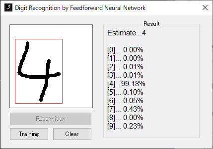

## Digit Recognition with Neural Network
Handwritten Digit Recognition consists of 3-layer Feedforward Neural Network.   




## Specific

#### Network
  
- 1st layer (input) 　　    
    784 Neurons (28x28) 　　  
  
- 2nd layer (hidden) 　　    
    100 Neurons 　　    
    Sigmoid Activation Function

- 3rd layer (output) 　　    
    10 Neurons (0-9) 　　    
    Softmax function

- Cross Entropy Backpropagation
- Autocentering Input Digit


#### Application

- MFC app
- Build with Visual Studio 2017

## Training

1. Download MNIST dataset from http://yann.lecun.com/exdb/mnist/
2. Unzip dataset and locate to below directory
```
     train_data/ 
            ├ train-images-idx3-ubyte
            └ train-labels-idx1-ubyte

     test_data/ 
            ├ t10k-images-idx3-ubyte
            └ t10k-labels-idx1-ubyte
```

3. Click "Training" and select train/test dir

  