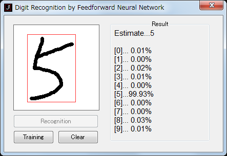

## Digit Recognition with Neural Network
Handwritten Digit Recognition consists of 3-layer Feedforward Neural Network.   

## Specific

#### Network
  
- 1st layer (input) 　　    
    784 Neurons　(28x28) 　　  
  
- 2nd layer (hidden) 　　    
    100 Neurons 　　    
    Sigmoid Activation Function

- 3rd layer (output) 　　    
    10 Neurons　(0-9) 　　    
    Softmax function

- Cross Entropy Backpropagation
- Autocentering Input Digit

#### Application

- Windows MFC based
- Build in VS2017

## Usage

- #### Training
  Select training button and choose folder of MNIST Training/Test Images.  

- #### Recognition
  Select recognition button after writing one digit.
  